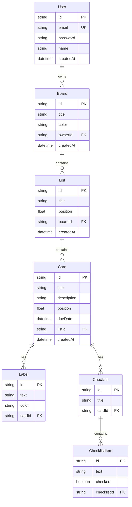
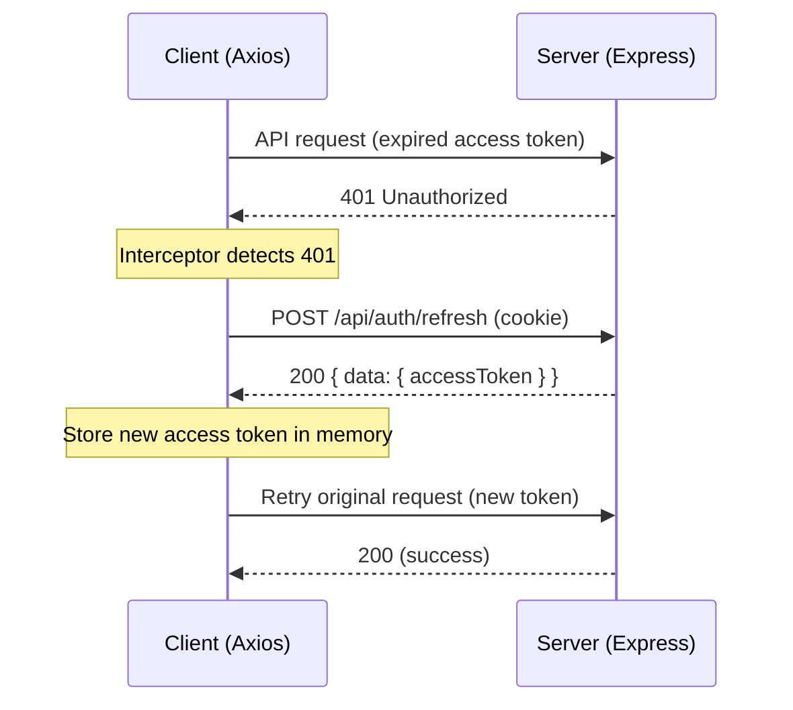

# Architecture

## Overview

The Trello Clone is a full-stack JavaScript application organized as a monorepo with three top-level packages:

| Package | Purpose | Key Technologies |
|---|---|---|
| `client/` | Single-page application | React 18, Vite 5, Tailwind CSS, @hello-pangea/dnd |
| `server/` | REST API | Express 4, Prisma ORM, bcryptjs, jsonwebtoken |
| `e2e/` | End-to-end tests | Playwright |

## Monorepo Layout

```
trello-clone/
├── client/                 # React SPA
│   ├── src/
│   │   ├── api/            # Axios HTTP clients (auth, boards, cards, lists, cardDetails)
│   │   ├── components/     # Reusable UI components (Header, ListColumn, CardTile, CardModal, DueDateBadge)
│   │   ├── context/        # React context providers (AuthContext)
│   │   ├── hooks/          # Custom hooks (useAuth)
│   │   ├── pages/          # Route-level pages (LoginPage, RegisterPage, BoardsPage, BoardView)
│   │   ├── __tests__/      # Vitest unit/component tests
│   │   ├── App.jsx         # Route definitions and ProtectedRoute wrapper
│   │   └── main.jsx        # Application entry point
│   ├── index.html
│   ├── vite.config.js
│   ├── tailwind.config.js
│   └── package.json
├── server/                 # Express REST API
│   ├── src/
│   │   ├── controllers/    # Request handlers (auth, board, list, card, cardDetail)
│   │   ├── middleware/     # Express middleware (auth, errorHandler)
│   │   ├── prisma/         # Prisma schema and client
│   │   ├── routes/         # Express routers
│   │   ├── __tests__/      # Jest integration tests
│   │   └── index.js        # Server entry point
│   ├── jest.config.js
│   └── package.json
├── e2e/                    # Playwright E2E tests
│   ├── tests/              # Test specs (auth, boards, lists-cards, card-detail)
│   ├── fixtures/           # Test helper utilities
│   ├── playwright.config.ts
│   └── package.json
├── docs/features/          # Feature documentation
├── CLAUDE.md               # AI assistant context
└── README.md               # Project README
```

## Database Schema

The application uses PostgreSQL with Prisma ORM. All IDs are CUIDs generated by Prisma.



## Request/Response Conventions

- **Success responses** follow the shape `{ data: ... }`.
- **Error responses** follow the shape `{ error: "message" }`.
- Protected endpoints require the `Authorization: Bearer <accessToken>` header.
- The refresh token is stored in an `httpOnly` cookie named `refreshToken`.

## JWT Refresh Flow

Access tokens are short-lived (15 minutes). When a request returns a `401`, the Axios response interceptor transparently refreshes the token using the cookie-based refresh token (7-day expiry) and retries the original request. Concurrent failing requests are queued and replayed once a single refresh completes.



## Key Design Decisions

| Decision | Rationale |
|---|---|
| Access token in React state (not localStorage) | Prevents XSS from reading the token; a page refresh requires re-authentication via the refresh cookie |
| Refresh token in httpOnly cookie | JavaScript cannot access the cookie, mitigating XSS-based token theft |
| Float-based position field | Allows inserting items between existing positions without reindexing the entire list; see [Drag and Drop](./drag-and-drop.md) |
| @hello-pangea/dnd over react-beautiful-dnd | Actively maintained community fork with the same API surface |
| Zod validation on the server | Provides type-safe request validation with clear error messages |
| Prisma cascading deletes | Deleting a board removes all its lists; deleting a list removes all its cards; deleting a card removes labels, checklists, and items |
