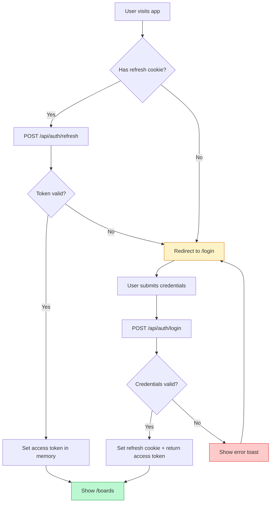

# Authentication

## Overview

The Trello Clone uses a dual-token authentication strategy. A short-lived **access token** (JWT, 15-minute expiry) is held in React component state, while a long-lived **refresh token** (JWT, 7-day expiry) is stored in an `httpOnly` cookie. This design balances security against usability: XSS attacks cannot read either token from JavaScript-accessible storage, and users stay logged in across page refreshes without storing secrets in `localStorage`.

## Registration Flow

1. The user fills in **name**, **email**, and **password** on the registration page.
2. Client-side validation ensures all fields are present and the password is at least 6 characters.
3. The client sends `POST /api/auth/register` with `{ name, email, password }`.
4. The server validates the payload with Zod (password must be at least 8 characters on the server).
5. If the email is already in use, the server responds with `409 { error: "Email already in use" }`.
6. The password is hashed with **bcrypt** using **10 salt rounds**.
7. A new `User` record is created in PostgreSQL via Prisma.
8. The server responds with `201 { data: { id, email, name } }`.
9. The client automatically calls the login endpoint to obtain tokens.

## Login Flow

1. The user submits **email** and **password** on the login page.
2. The client sends `POST /api/auth/login` with `{ email, password }`.
3. The server looks up the user by email and compares the password hash using `bcrypt.compare`.
4. On success, the server generates:
   - An **access token** signed with `JWT_SECRET` (15-minute expiry).
   - A **refresh token** signed with `JWT_REFRESH_SECRET` (7-day expiry).
5. The refresh token is set as an `httpOnly`, `sameSite: lax` cookie.
6. The response body contains `{ data: { accessToken, user: { id, email, name } } }`.
7. The client stores the access token in memory and the user object in React state.

## Token Refresh

When any API call returns a `401 Unauthorized`, the Axios response interceptor:

1. Sends `POST /api/auth/refresh` with the cookie-based refresh token.
2. Receives a new access token.
3. Retries the original request with the fresh token.
4. If multiple requests fail simultaneously, they are queued and replayed after a single refresh.

If the refresh itself fails, the user is redirected to `/login`.

## Logout

1. The client calls `POST /api/auth/logout`.
2. The server clears the `refreshToken` cookie.
3. The client sets the access token to `null` and clears the user from React state.
4. The user is redirected to `/login`.

## Auth Flow Diagram



## Password Hashing

- Algorithm: **bcrypt** via the `bcryptjs` library
- Salt rounds: **10**
- The plain-text password is never stored or logged

## Token Storage Rationale

| Token | Storage | Why |
|---|---|---|
| Access token | React state (in-memory) | Cannot be read by XSS; lost on page refresh (refresh flow recovers it) |
| Refresh token | httpOnly cookie | Cannot be accessed by JavaScript; automatically sent with requests to `/api/auth/refresh` |

## API Reference

### `POST /api/auth/register`

Register a new user account.

**Request body:**
```json
{
  "name": "Jane Doe",
  "email": "jane@example.com",
  "password": "securepassword"
}
```

**Success response** (`201`):
```json
{
  "data": {
    "id": "clx1abc...",
    "email": "jane@example.com",
    "name": "Jane Doe"
  }
}
```

**Error responses:**
- `400` - Validation error (missing fields, short password)
- `409` - Email already in use

### `POST /api/auth/login`

Authenticate and receive tokens.

**Request body:**
```json
{
  "email": "jane@example.com",
  "password": "securepassword"
}
```

**Success response** (`200`):
```json
{
  "data": {
    "accessToken": "eyJhbG...",
    "user": {
      "id": "clx1abc...",
      "email": "jane@example.com",
      "name": "Jane Doe"
    }
  }
}
```

**Set-Cookie header:** `refreshToken=eyJhbG...; Path=/; HttpOnly; SameSite=Lax`

**Error responses:**
- `400` - Validation error
- `401` - Invalid email or password

### `POST /api/auth/refresh`

Exchange a refresh cookie for a new access token.

**Request:** No body required. The `refreshToken` cookie is sent automatically.

**Success response** (`200`):
```json
{
  "data": {
    "accessToken": "eyJhbG..."
  }
}
```

**Error responses:**
- `401` - Missing or invalid/expired refresh token

### `POST /api/auth/logout`

Clear the refresh token cookie.

**Success response** (`200`):
```json
{
  "data": {
    "message": "Logged out"
  }
}
```
