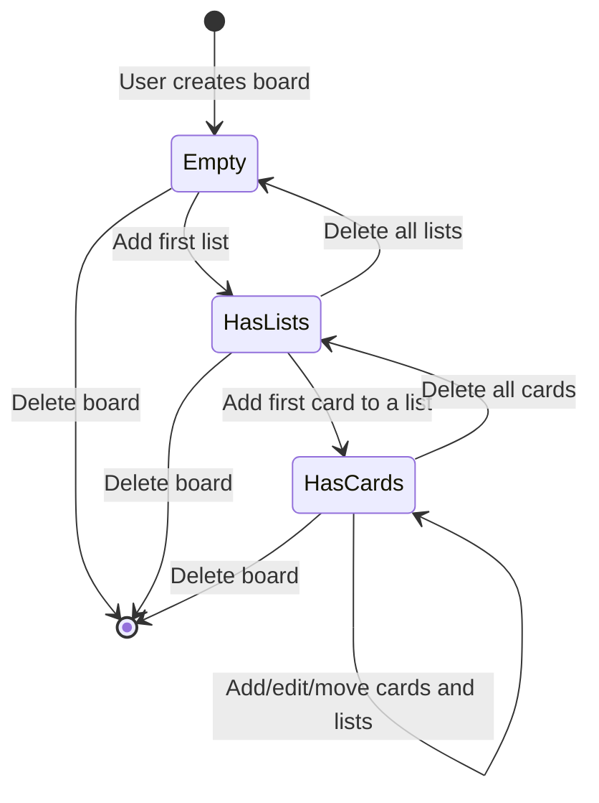

# Boards

## Overview

Boards are the top-level organizational unit in the Trello Clone. Each board belongs to a single user and contains an ordered collection of lists. Boards have a title and a background color chosen from a set of presets.

## Board CRUD

| Operation | UI Action | API Call |
|---|---|---|
| **Create** | Click "Create new board" tile, enter title, pick color, submit | `POST /api/boards` |
| **Read** | Visit `/boards` (dashboard) or `/boards/:id` (detail) | `GET /api/boards` or `GET /api/boards/:id` |
| **Update** | (Board settings - title/color update) | `PATCH /api/boards/:id` |
| **Delete** | Hover on board tile, click trash icon, confirm dialog | `DELETE /api/boards/:id` |

Deleting a board cascades through Prisma's `onDelete: Cascade` relation, removing all associated lists, cards, labels, checklists, and checklist items.

## Color Presets

The board creation form offers six preset background colors:

| Color | Hex Code |
|---|---|
| Blue (default) | `#0079bf` |
| Orange | `#d29034` |
| Green | `#519839` |
| Red | `#b04632` |
| Purple | `#89609e` |
| Pink | `#cd5a91` |

The selected color is stored in the `Board.color` field and applied as the `backgroundColor` CSS property on both the board tile and the board view page.

## Board State Lifecycle



## Lists Within a Board

Lists are created from the board view by clicking "Add another list" and entering a title. Each list has a `position` field (Float) that determines display order. See [Drag and Drop](./drag-and-drop.md) for details on how positions are calculated during reordering.

### List Operations

| Operation | UI Action | API Call |
|---|---|---|
| **Create** | Click "Add another list", type title, click "Add list" | `POST /api/boards/:boardId/lists` |
| **Rename** | Click list title, edit inline, press Enter or blur | `PATCH /api/boards/:boardId/lists/:id` |
| **Reorder** | Drag list to new position | `PATCH /api/boards/:boardId/lists/:id/move` |
| **Delete** | Click trash icon on list header, confirm dialog | `DELETE /api/boards/:boardId/lists/:id` |

Deleting a list cascades to remove all of its cards (and their labels, checklists, and items).

## API Reference

### Boards

#### `GET /api/boards`

List all boards for the authenticated user.

**Response** (`200`):
```json
{
  "data": [
    {
      "_id": "clx1abc...",
      "title": "My Board",
      "color": "#0079bf",
      "createdAt": "2025-01-15T10:30:00.000Z"
    }
  ]
}
```

#### `POST /api/boards`

Create a new board.

**Request body:**
```json
{
  "title": "Sprint Board",
  "color": "#519839"
}
```

**Response** (`201`):
```json
{
  "data": {
    "_id": "clx2def...",
    "title": "Sprint Board",
    "color": "#519839",
    "ownerId": "clx1abc...",
    "createdAt": "2025-01-15T11:00:00.000Z"
  }
}
```

#### `GET /api/boards/:id`

Get a board with its lists and cards.

**Response** (`200`):
```json
{
  "data": {
    "_id": "clx2def...",
    "title": "Sprint Board",
    "color": "#519839",
    "lists": [
      {
        "_id": "clx3ghi...",
        "title": "To Do",
        "position": 65536,
        "cards": []
      }
    ]
  }
}
```

#### `PATCH /api/boards/:id`

Update board title or color.

**Request body:**
```json
{
  "title": "Updated Title"
}
```

#### `DELETE /api/boards/:id`

Delete a board and all associated data.

**Response** (`200`):
```json
{
  "data": { "message": "Board deleted" }
}
```

### Lists

#### `POST /api/boards/:boardId/lists`

Create a new list in a board.

**Request body:**
```json
{
  "title": "In Progress"
}
```

#### `PATCH /api/boards/:boardId/lists/:id`

Update list title.

**Request body:**
```json
{
  "title": "Done"
}
```

#### `PATCH /api/boards/:boardId/lists/:id/move`

Update list position (used during drag-and-drop).

**Request body:**
```json
{
  "position": 98304
}
```

#### `DELETE /api/boards/:boardId/lists/:id`

Delete a list and all its cards.
