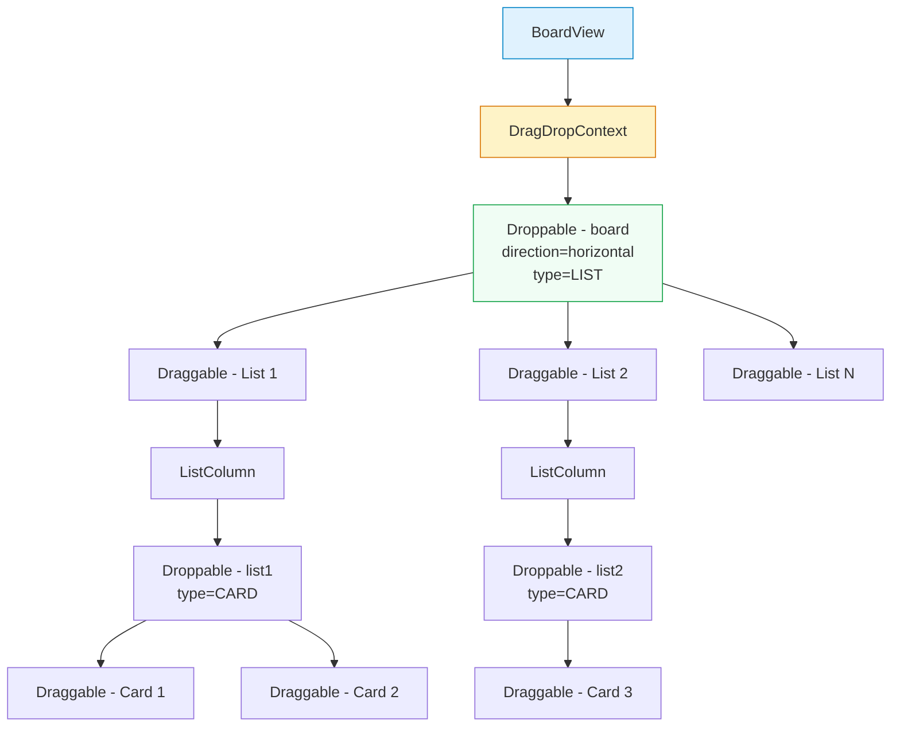
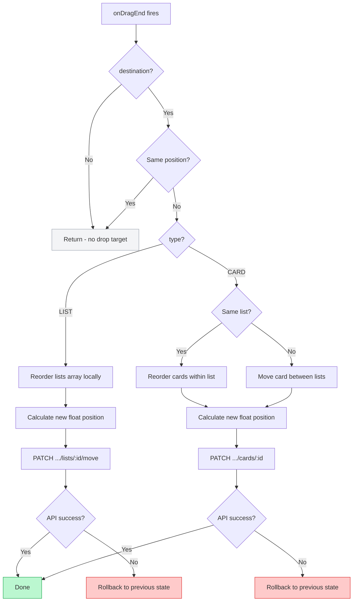

# Drag and Drop

## Overview

The Trello Clone uses **@hello-pangea/dnd** for drag-and-drop functionality. This is a community-maintained fork of `react-beautiful-dnd` with the same API surface but active maintenance and bug fixes. It enables reordering of both lists (horizontal drag within the board) and cards (vertical drag within a list, or cross-list moves).

## Component Hierarchy



The component tree nests as follows:

1. **`BoardView`** wraps everything in a `<DragDropContext>` with a single `onDragEnd` handler.
2. The board-level `<Droppable>` (direction `"horizontal"`, type `"LIST"`) contains all list columns.
3. Each **`ListColumn`** is a `<Draggable>` (for reordering lists) that contains its own `<Droppable>` (type `"CARD"`) for card reordering.
4. Each **`CardTile`** is a `<Draggable>` within its parent list's droppable zone.

The `type` field ensures that lists can only be dropped into the board droppable and cards can only be dropped into list droppables.

## Float Position Strategy

Instead of using integer indices that require reindexing all items after every move, the application uses **float-based positions**. This approach is inspired by how Trello itself handles ordering.

### How It Works

Each `List` and `Card` has a `position` field of type `Float` in the database. When an item is placed between two existing items, its new position is calculated as the midpoint:

```
newPosition = (beforePosition + afterPosition) / 2
```

### Position Calculation

The `calculatePosition` function handles three cases:

| Scenario | Calculation | Example |
|---|---|---|
| Empty list / append to end | `lastPosition + 65536` | `65536 + 65536 = 131072` |
| Insert at beginning | `firstPosition / 2` | `65536 / 2 = 32768` |
| Insert between two items | `(before + after) / 2` | `(65536 + 131072) / 2 = 98304` |

The initial spacing of `65536` (2^16) provides ample room for insertions before precision becomes a concern. In practice, a user would need to perform hundreds of consecutive insertions at the same position to exhaust floating-point precision.

### When to Re-index

While not currently implemented, a re-indexing strategy would be needed when the gap between two adjacent positions becomes smaller than a threshold (e.g., `< 0.001`). At that point, all positions in the list should be reassigned evenly (e.g., `65536, 131072, 196608, ...`).

## The `onDragEnd` Handler



## Optimistic Update Pattern

All drag-and-drop operations follow an optimistic update strategy:

1. **Snapshot** the current state before the drag.
2. **Apply** the reorder locally in React state immediately (the UI updates instantly).
3. **Send** the API request in the background with the calculated float position.
4. **On failure**, rollback to the snapshot and show an error toast.

This pattern ensures that the drag feels instantaneous to the user, with no visible delay while waiting for the server response. The code stores a `previousLists` snapshot before each operation:

```javascript
const previousLists = lists; // for list moves

const previousLists = lists.map((l) => ({
  ...l,
  cards: [...(l.cards || [])],
})); // for card moves (deep copy)
```

If the API call throws, the state is restored:

```javascript
catch {
  toast.error('Failed to move list');
  setLists(previousLists);
}
```

## Cross-List Card Moves

When a card is dragged from one list to another:

1. The card is removed from the source list's `cards` array.
2. The card is inserted into the destination list's `cards` array at the target index.
3. The new float position is calculated relative to the destination list's cards.
4. The API call sends both the new `listId` and the new `position`.

This is handled as a single `PATCH` request to the cards endpoint with `{ listId, position }` in the body.
