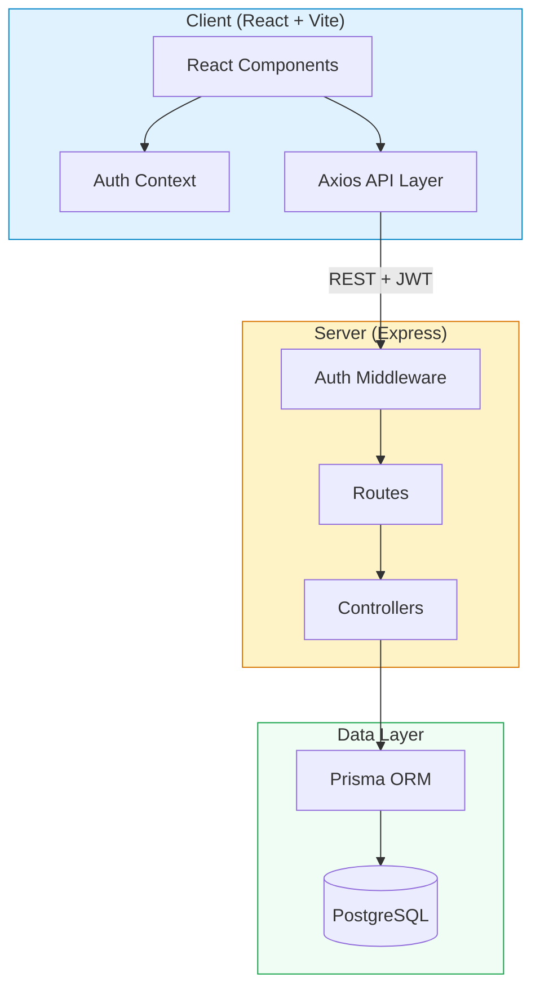

# Trello Clone Documentation

A full-stack Trello clone built as a portfolio project. This application replicates core Trello functionality including boards, lists, cards with drag-and-drop reordering, labels, checklists, due dates, and user authentication with JWT refresh tokens.

## Documentation Index

| Document | Description |
|---|---|
| [Architecture](./architecture.md) | Full-stack architecture overview, monorepo layout, ER diagram, and JWT refresh flow |
| [Authentication](./auth.md) | Registration, login, password hashing, token strategy, and API reference |
| [Boards](./boards.md) | Board CRUD operations, color presets, list management, and API reference |
| [Cards](./cards.md) | Card creation/editing, due date logic, checklists, labels, and API reference |
| [Drag and Drop](./drag-and-drop.md) | @hello-pangea/dnd integration, position strategy, and optimistic updates |

## Architecture at a Glance

## Quick Links

- **Setup instructions**: See the [project README](../../README.md)
- **Server tests**: `cd server && npm test`
- **Client tests**: `cd client && npm test`
- **E2E tests**: `cd e2e && npx playwright test`
